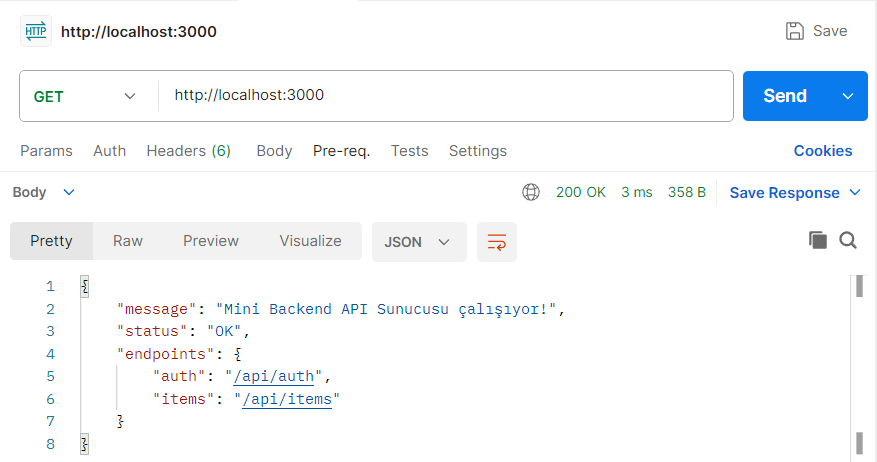
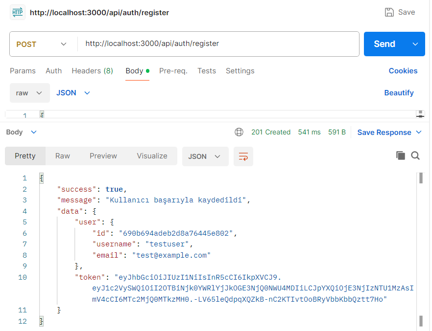
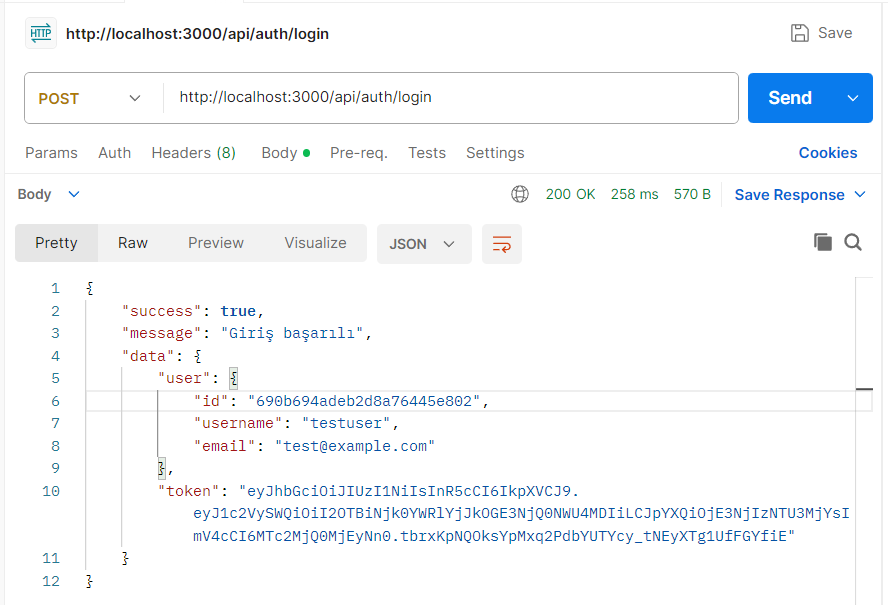
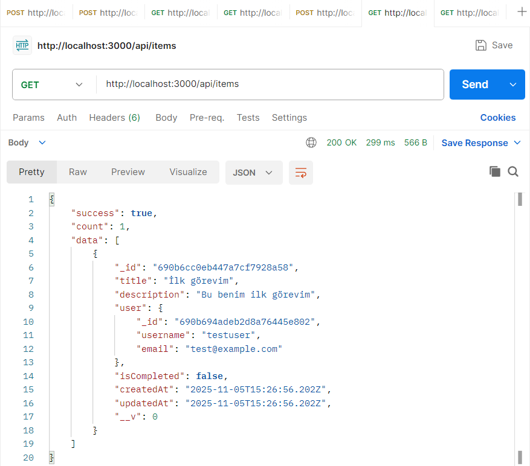
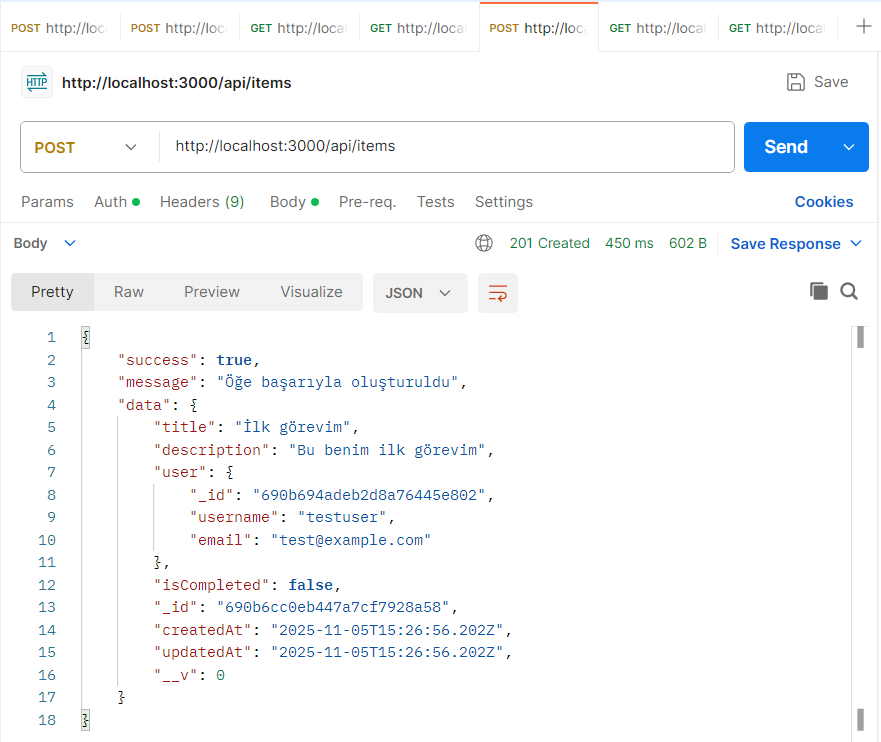
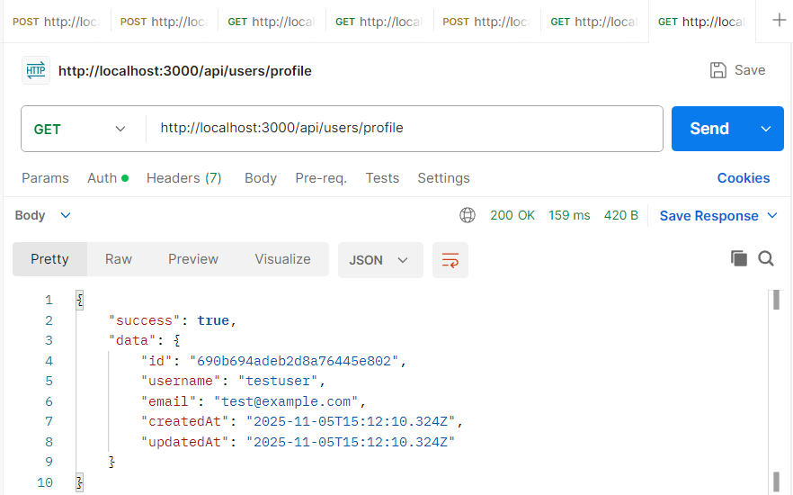
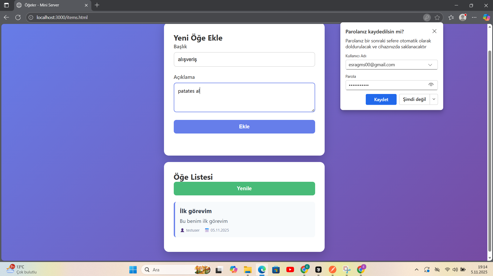
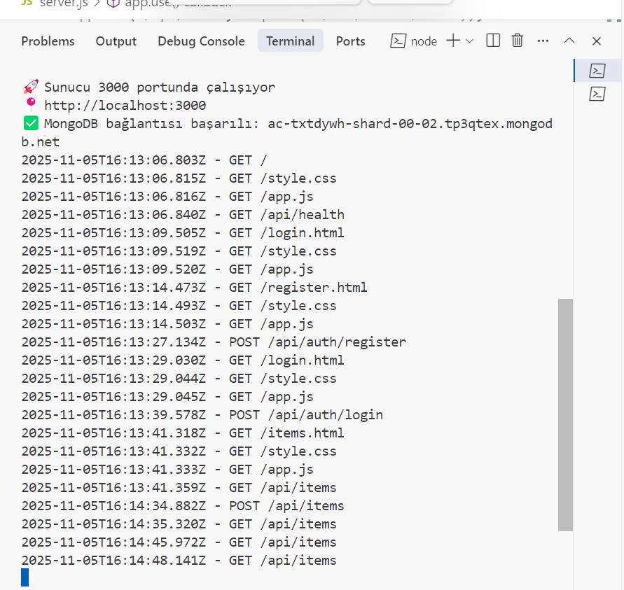

# 🚀 Mini Backend API Sunucusu

Modern REST API sunucusu - Node.js, Express ve MongoDB ile geliştirilmiş. JWT kimlik doğrulama, CRUD işlemleri ve production-ready özellikler içerir.

[](https://nodejs.org/)
[](https://expressjs.com/)
[](https://www.mongodb.com/)

## ✨ Özellikler

- 🔐 **Kullanıcı Yönetimi** - Register, Login, JWT Authentication
- 📝 **CRUD İşlemleri** - Create, Read, Update, Delete
- 🛡️ **Güvenlik** - Helmet.js, Rate Limiting, Input Validation
- 📊 **Veritabanı** - MongoDB Atlas entegrasyonu
- 📄 **Pagination** - Sayfalama desteği
- 🌐 **CORS** - Cross-Origin Resource Sharing
- 📱 **Web Frontend** - Mobil uyumlu test arayüzü

## 🛠️ Teknolojiler

**Backend:**
- Node.js + Express.js
- MongoDB + Mongoose
- JWT (jsonwebtoken)
- bcrypt (şifre hash'leme)

**Güvenlik & Validation:**
- Helmet.js
- express-validator
- express-rate-limit
- CORS

## 📸 Test Ekran Görüntüleri

### Postman Testleri

| Endpoint | Test |
|----------|------|
| Health Check |  |
| Register |  |
| Login |  |
| Get Items |  |
| Create Item |  |
| User Profile |  |

### Web Uygulaması Testleri

**Mobil Uyumlu Web Arayüzü:**


**Terminal Test Sonuçları:**


## 🚀 Hızlı Başlangıç

```bash
# 1. Repository'yi klonla
git clone https://github.com/EsraGumus7/mini-server.git
cd mini-server

# 2. Paketleri yükle
npm install

# 3. .env dosyasını oluştur
cp env.example .env

# 4. .env dosyasını düzenle (MongoDB URI ekle)
nano .env

# 5. Sunucuyu başlat
npm start
```

Sunucu `http://localhost:3000` adresinde çalışacaktır.

## 📚 API Endpoint'leri

### Authentication
- `POST /api/auth/register` - Kullanıcı kaydı
- `POST /api/auth/login` - Kullanıcı girişi

### Users
- `GET /api/users/profile` - Kullanıcı profili (🔒 Protected)

### Items
- `GET /api/items?page=1&limit=10` - Tüm öğeler (Pagination)
- `GET /api/items/:id` - Tek öğe getir
- `POST /api/items` - Yeni öğe oluştur (🔒 Protected)
- `PUT /api/items/:id` - Öğe güncelle (🔒 Protected)
- `DELETE /api/items/:id` - Öğe sil (🔒 Protected)

**🔒 Protected:** Bearer Token gerektirir

## 🌐 Web Arayüzü

Proje, mobil uyumlu bir web arayüzü içerir. Sunucu başladıktan sonra:

- **Ana Sayfa:** `http://localhost:3000`
- **Login:** `http://localhost:3000/login.html`
- **Register:** `http://localhost:3000/register.html`
- **Items:** `http://localhost:3000/items.html`

## 📁 Proje Yapısı

```
mini-server/
├── src/
│   ├── config/          # MongoDB bağlantısı
│   ├── controllers/     # İş mantığı
│   ├── middleware/      # Auth, Validation, Error handling
│   ├── models/          # Mongoose modelleri
│   ├── routes/          # API endpoint'leri
│   └── utils/           # JWT utilities
├── frontend/            # Web arayüzü
├── screenshots/         # Test ekran görüntüleri
└── server.js            # Ana sunucu dosyası
```

## 🔧 Geliştirme

```bash
# Development mode
npm start

# Environment variables
PORT=3000
JWT_SECRET=your-secret-key
MONGODB_URI=mongodb+srv://...
```

## 📝 Notlar

- Production ortamında `.env` dosyasını git'e eklemeyin
- `JWT_SECRET` değerini güçlü bir anahtarla değiştirin
- MongoDB Atlas Network Access ayarlarını yapılandırın

## 📄 Lisans

ISC License

Backend geliştirme ve REST API öğrenme projesi.

⭐ **Star** vermeyi unutmayın! Backend geliştirme ve REST API öğrenme projesi.
